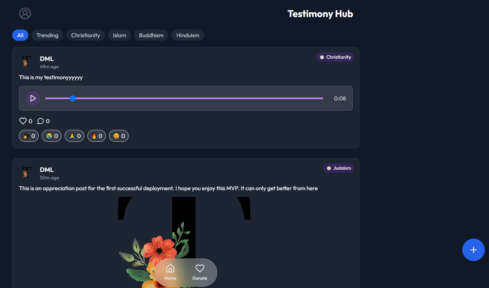

# MyTESTIMONY APP
A full-stack web application that allows users from all faiths to share, engage with, and celebrate personal testimonies and spiritual experiences. Think of it as a modern, interactive platform for stories of faith — designed with community, authenticity, and accessibility in mind

**Link to project:** https://mytestimony.vercel.app/

## How It's Made:

**Tech used:** React, Context API, Axios, JWT & Cooies for Auth, Multer, Node.js & Express etc

Infinite Scroll Feed — Browse testimonies in a continuous, immersive scroll experience like Twitter
Voice-to-Text Posting — Users can speak their testimonies and have them converted to text using a live mic input.
Emoji Reactions & Likes — Posts support rich emoji-based reactions with toggling and real-time counts.
Media Carousel — Users can attach images and audio to their testimony; media is displayed elegantly within a swipeable carousel.
User Profiles — Fully editable profiles with personalized testimony feeds and liked posts tab.
Dark Mode UI — Clean and modern dark interface built with user experience in mind.
Religious Diversity — Posts can be tagged by religion, promoting interfaith unity and exploration.

## Optimizations

These are some features in development that will take the pp to the next level:

Real-Time Notifications (using Socket.IO) for reactions, likes, and comments.
Comment Section — Users will soon be able to comment directly on posts.
Moderation & Reporting Tools — Content moderation with admin dashboard and post reporting.
Progressive Web App (PWA) capabilities for offline support and home screen installation.

## Lessons Learned:

Designing reusable, dynamic components that feel premium
Efficient global state management with React Context
Preparing features in a backend-ready format for future scaling

## Examples:
Take a look at these couple examples that I have in my own portfolio:

**MyBookStory:** https://mybookstory.vercel.app/

**Post-Check:** https://post-checkapp.onrender.com/

**Marketplace:** https://1marketplace.vercel.app/marketplace
